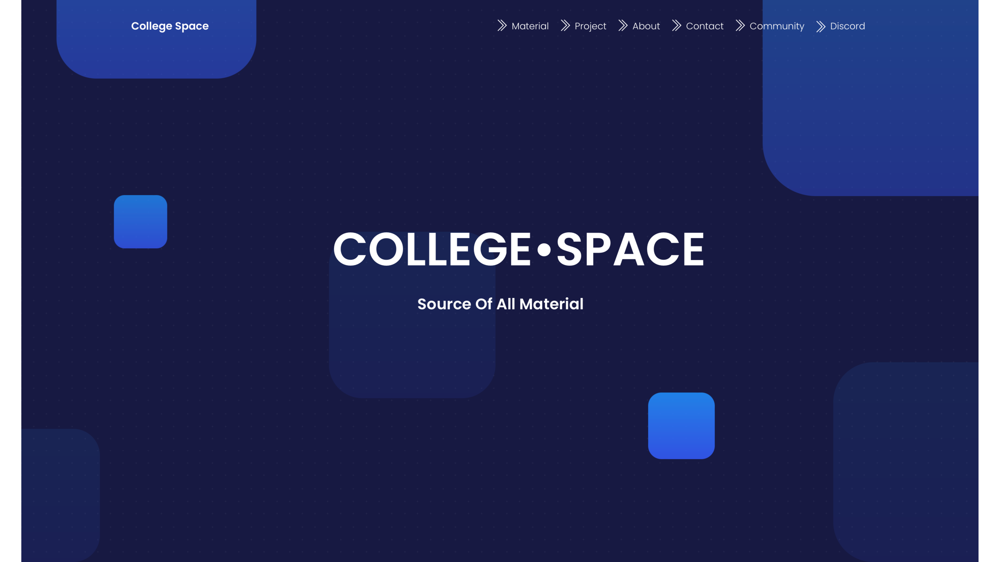

# College Space

  

## Live Demo
-  [college-space.vercel.app](https://college-space.vercel.app/)

## Overview

College Space is an educational platform offering a wide variety of learning resources, including documents, exam papers of previous years
on key subjects, and project materials.

## Features

- **Responsive Design**: Works seamlessly across desktops, tablets, and mobile devices.
- **Download Materials**: It includes ability to  download Materials.
- **Projects**: It also has projects to learn from and inspire from as well.
- **Join Community**: College Space has community for students to learn from each others.

## Getting Started

To get started with T-Writer, follow these steps:

1. Clone the repository: `git clone https://github.com/ninadvyas/College-Space.git`
2. Navigate to the project directory: `cd College-Space`
3. Install dependencies: `npm install`
4. Run the application: `npm start`
5. Open the application in a web browser: `http://localhost:3000`

## License

This project is licensed under the MIT License - see the [LICENSE](LICENSE) file for details.

